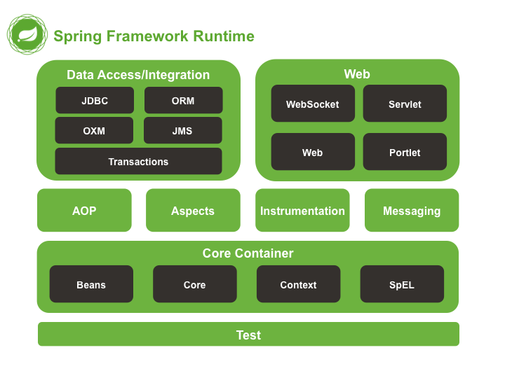

# 01. Spring Framework 개요

 

## 01-01. Spring 역사
- EJB를 주 프레임워크로 사용할 때 불편했던 점들(무거움, 따라야 할 스펙들이 복잡함)을 해소하기 위해 탄생함
- 2002년 로드존슨이 출판한 도서 Expert One-on-One J2EE Design and Development에 선보인 코드가 현재 Spring의 근간이 됨
- 이 도서를 읽은 개발자들이 '코드가 책으로만 존재하기에는 너무 아깝다'라며 로드 존슨의 허가를 받은 뒤 프레임워크로 발전시킴
- 2003년 6월 Apache 2.0 License로 공개됨
- 2004년에 1.0v이 배포됨

 

## 01-02. Spring Framework란?
- 자바, 엔터프라이즈 개발, 오픈소스, light-weigth "애플리케이션 프레임워크"이다.
- 특정 계층이나 기술, 업무 분야에 국한되지 않고 애플리케이션의 전 영역을 포괄하는 범용적인 프레임워크를 말함.
- 굉장히 범용적이고 다양한 분야에서 활용하고 있지만, 모두 다 알아야 활용할 수 있는 것은 아닌 만큼 기본에 충실해서 학습해야 합니다.

### 1) 경량급 프레임워크
- 단순한 웹 컨테이너에서도 엔터프라이즈 개발의 고급기술을 대부분 사용할 수 있습니다.
- EJB에 비해 경량급입니다. 또한 일반 자바 객체만을 사용하여 엔터프라이즈급의 고급 기술을 구현할 수 있습니다.

### 2) 엔터프라이즈 개발 용이
- 개발자가 복잡하고 실수하기 쉬운 Low Level에 많이 신경 쓰지 않으면서 Business Logic 개발에 전념할 수 있도록 해줍니다.

### 3) 오픈소스
- Spring은 OpenSource 로서 누구나 사용할 수 있습니다. 다만, 아무나 잘 하는 것은 아니며, 무료 프레임워크의 단점을 극복하고, 장점을 극대화하여 사용하여하여 합니다.

 

## 01-03. Spring Framework 특징
### 1) 컨테이너 제공
- Spring 컨테이너(Container)는 Java 객체의 Life Cycle을 관리하며, Spring 컨테이너(Container)로부터 필요한 객체를 가져와 사용할 수 있습니다.

### 2) DI(Dependency Injection) 지원
- Spring은 설정 파일이나 어노테이션(Annotation)을 통해서 객체 간의 의존관계를 설정할 수 있도록 하고 있습니다.

### 3) AOP(Aspect Oriented Programming) 지원
- Spring은 트랜잭션(Transaction)이나 로깅(Logging), 보안(Security)과 같이 공통적으로 필요로 하는 모듈들을 실제 핵심 모듈에서 분리해서 적용할 수 있습니다.

### 4) POJO(Plain Old Java Object) 지원
- Sring 컨테이너(Container)에 저장되는 Java객체는 특정한 인터페이스(Interface)를 구현하거나, 특정 클래스(Class)를 상속받지 않아도 됩니다.

### 5) 트랜잭션(Transaction) 처리를 위한 일관된 방법을 지원
- JDBC(Java DataBase Connectivity), JTA(Java Transaction API) 등 어떤 트랜잭션을 사용하더라도 설정(Configuration)을 통해 정보를 관리하므로 트랜잭션 구현에 상관없이 동일한 코드를 사용할 수 있습니다.

### 6) 영속성(Persistence)과 관련된 다양한 API 지원
- Spring은 Mybatis, Hibernate 등 데이터베이스 처리를 위한 ORM(Object Relational Mapping) 프레임워크들과의 연동 지원합니다.

 

## 01-04. Spring Framework 주요 모듈 구성

### 1) Data Access/Integration(데이터 접근 및 통합)

JDBC(Java DataBase Connectivity) : Java 기반 애플리케이션의 데이터를 데이터베이스에 저장 및 업데이트하거나, 데이터베이스에 저장된 데이터를 Java에서 사용할 수 있도록 하는 자바 API입니다.

ORM(Object Relational Mpping) : 객체와 관계형 데이터베이스의 데이터를 자동으로 매핑(연결)해주는 것을 말합니다.

OXM(Object-XML Mapping) : XML과 자바(Java) 오브젝트를 매핑해서 상호 변환해주는 기술입니다.

JMS(Java Message Service) : 사람이 아닌 애플리케이션의 구성 요소가 소비하는 요청, 보고서, 이벤트로 메시지를 작성, 전송 수신 및 읽을 수 있는 메시징 서비스를 제공하는 것을 말합니다.

Transactions : 데이터베이스에서 여러 요청이 한 꺼번에 처리가 되어야 하는 트랜잭션(Transaction)이 정의되고, 구현될 수 있도록 어노테이션으로 제공합니다.

 

### 2) Web
- Websocket :  HTTP 통신의 단점인 단방향 통신을 개선하기 위하여 웹 소켓을 활용하여 반 영구적인 양방향 통신을 제공합니다.
- Servlet : MVC 처리 패턴에서 Controller에 해당하는 요청에 대한 처리 작업이 진행되도록 합니다.
- Web : JSP(Java Server Page)에 속하는 Expression, Directive, Declaration, Expression Language, Java Standard Tag Library 등을 활용할 수 있는 웹 모듈을 제공합니다.
- Portlet : 포털 페이지를 구성하는 웹 컴포넌트(Web Component)를 제공하며, 또한, MVC 처리 패턴에서 View 속하는 곳에 데이터를 처리하여 보내 질 수 있는 역할을 수행합니다.

 

### 3) Core Container
- 주요한 객체들(Bean)을 관리해주는 아주 중요한 모듈
- Beans : 스프링 컨테이너에 의해 관리되는 재사용 가능한 소프트웨어 컴포넌트로서 하나의 클래스로 부터 얻어진 객체이며, 주입(Inject)의 대상입니다. XML의 bean 태그나 @Configuration 어노테이션으로 설정되는 주입 설정 클래스에서 @Bean 어노테이션으로 설정됩니다.
- Core : 스프링 프레임워크의 근간이 되는 요소로 IoC(Invert Of Control) 또는 DI(Dependency Injection)기능을 지원하는 요소입니다.
- Context : 여러 Bean을 관련있는 요소로 각 각 분리하여 하나의 XML 파일로 구성될 수 있도록 하는 요소입니다.
- SpEL : Spring Expresion Language의 약자로 런타임(실행) 시 객체 그래프 쿼리 및 조작을 지원하는 표현 언어로서 #{표현식} 이나 ${표현식} 으로된 파라미터나 연산식, 비교식 등을 구현할 수 있도록 돕습니다.

### 4) Test
- JUnit 및 Spring Test 를 지원합니다.
- JUnit은 @Test, @Ignore, @Before, @After, @BeforeClass, @AfterClass 등의 어노테이션을 활용한 assert 메서드로 단위 테스트 프레임을 구성을 지원합니다.
- Spring Test는 @RunWith, @ContextConfiguration, @Autowired 어노테이션을 활용하여 별도의 컨텍스트 없이도 테스트 케이스를 작성할 수 있도록 지원합니다.

### 5) Spring Object
- AOP(Aspect-Oriented Programming) : 공통적으로 적용이 되어야 하는 부분이 여러 군데에 흩어져 있을 경우 사용시기(Jointpoint)가 되었을 경우 대비해 여러 사용시기(Jointpoint)를 정규 표현식인 포인트컷(Pointcut)으로 만들어 각 각의 대상 클래스에 있는 코드를 연결하여 하나의 객체로 만드는데 이를 위빙(Weaving)이라 하고, 위빙(Weaving) 된 것을 동작되도록 합니다. 이 때 위빙(Weaving)된 동작을 어드바이스(Advice)라고 합니다.
- Aspects : 보통 AspectJ에 의한 관점지향 프로그래밍을 의미하며, Spring AOP는 공통적인 문제를 해결하기 위해 간단히 구현하고, Spring Container에 의해 관리되는 Bean에만 적용하지만, Aspects는 Spring AOP보다 강력하고, 완전체를 별도로 구성하여 진행하기 때문에 많이 복잡해집니다.
- Instrumentation : 빈의 생명주기와 설정 그리고 처리방법을 관리하는 스프링 컨테이너입니다.
- Messaging : 시스템의 구성 요소 간에 메시징을 지원하고 관리하는 요소입니다.

